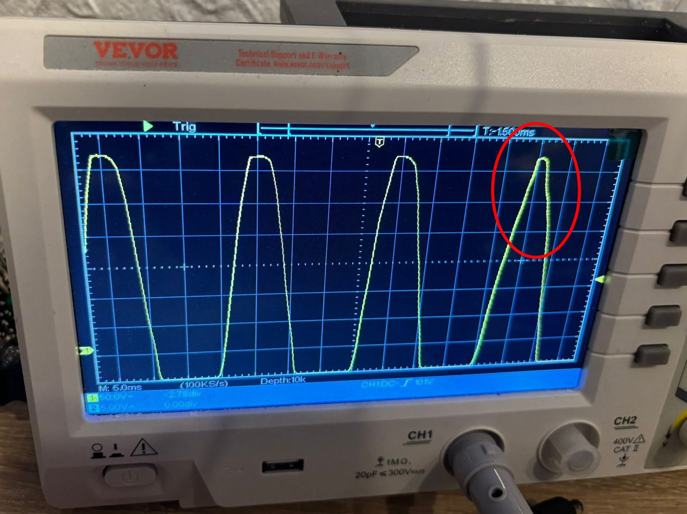
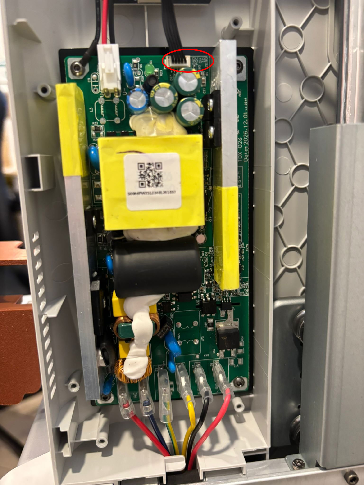
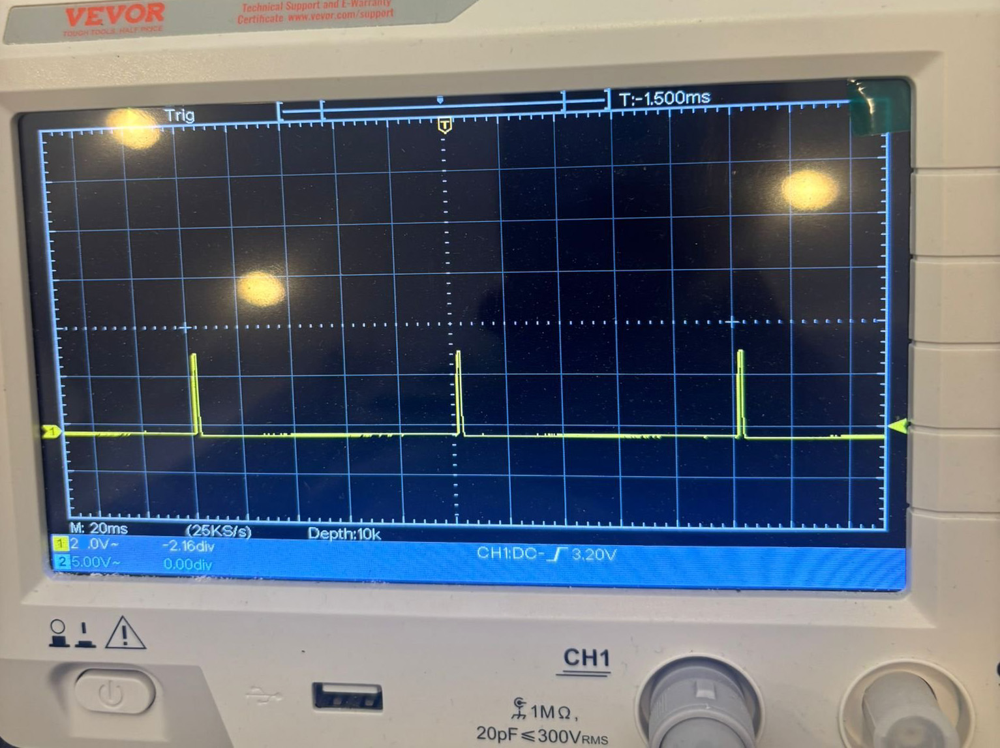
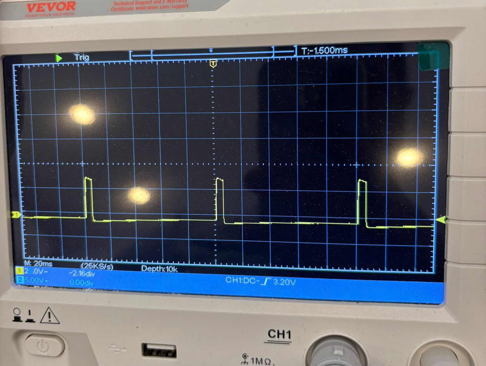

# Anycubic Kobra X — Bed Interceptor

An Arduino-based device that throttles the Anycubic Kobra X's heated bed control signal, converting its rapid pulse-width firing into infrequent, longer bang-bang cycles. The result is a much gentler load profile on the power supply, the triac, and the upstream AC source — at the cost of slightly slower warmup and a small steady-state temperature ripple.

## Why this exists

The Kobra X's heated bed is a **1000 W mains-voltage silicone pad** controlled by the mainboard via a triac driver. To deliver fractional power smoothly, the firmware uses **proportional pulse-width firing**: short trigger pulses every ~80 ms, with pulse widths ranging from 1 ms (minimum demand) to ~80 ms (100% duty cycle). That's roughly 12 load steps per second, every second the bed is regulating.

This is fine when the upstream supply is stiff. But every one of those pulses is a 1000 W load step — repeatedly stressing the PSU's input rectifier and bulk caps, the triac, and whatever sits upstream of the printer (UPS, inverter, generator, weak grid leg). On a battery-backed PV inverter in particular, the regulation loop visibly struggles to keep up with each pulse, distorting the AC waveform 12 times per second.

I noticed the problem because **every LED in the house flickered rhythmically at 2–3 Hz** whenever the bed was regulating on battery power (Anern AN-SCI02-PRO-6200 hybrid inverter). The flicker disappeared the moment the bed demand dropped to zero, regardless of any other printer activity. That symptom led me to scope the AC line and the IO control signal, and the picture became clear:


*The AC waveform becomes visibly "pointier" when the bed switches on (4th half-cycle in the trace). Each bed pulse causes a similar brief distortion — repeated continuously while the bed regulates.*

The flicker is just the most visible consequence. The underlying issue is **load profile**: the printer hammers the supply with fast, repeated 1 kW pulses where it could just as well draw the same average energy in fewer, longer chunks. Fewer transitions means less stress on the PSU, the triac, and the upstream source — and as a bonus, the flicker goes away.

## What the interceptor does

It converts the mainboard's fast pulse-width firing into **slow bang-bang cycles**: same average power delivered to the bed, but in larger and far less frequent bursts. Instead of ~12 load transitions per second, you get roughly one every 30–60 seconds in steady state.

An Arduino UNO R4 WiFi sits inline between the mainboard and the PSU board:

1. Reads the mainboard's IO control signal
2. Measures the average duty cycle over a 10-second window
3. Halves the requested ON time (damping factor to absorb the bed's thermal inertia)
4. If the resulting ON time is ≥ 3 seconds, drives the output HIGH for that duration; otherwise skips the window entirely
5. Returns to measurement mode for the next window

The mainboard's own PID loop self-compensates: when the bed cools below setpoint, the next window's measured demand is higher, eventually crossing the 3-second threshold and triggering a heating burst.

### What you observe with the interceptor running

- **Cold start (warmup)**: bed reaches setpoint in roughly 2× the normal time. Output is mostly continuous HIGH because mainboard demand is at 100%.
- **Steady state**: one heating burst every ~30–60 seconds, lasting 3–5 seconds. Bed temperature oscillates ±2–3°C around setpoint.
- **Load profile on the AC line**: a single clean transition per minute or so, instead of constant 12 Hz hammering.
- **LED flicker (if you had it)**: gone in steady state — only one barely-noticeable transition per minute.

## Hardware

- Anycubic Kobra X (latest firmware early 2026 — hardware revision TDX-026)
- Arduino UNO R4 WiFi (`R7FA4M1AB3CFM` / Renesas RA4M1)
- A few wires, optional small project box

The Arduino is powered from the printer's own 5V rail (available on the same connector as the IO signal).

### Why UNO R4 specifically

I initially tried an ESP32 (works, but needs a voltage divider for the 5V signal) and an Arduino Pro Mini 5V (worked briefly, then the input pin appeared to fail — probably damaged by accumulated transient spikes from the triac switching environment). The UNO R4 has more robust I/O protection and 5V-tolerant pins through onboard level shifters, making it the most reliable choice for this dirty signal environment.

If you replicate this and use a smaller/cheaper board, **add input protection**: 1 kΩ series resistor, plus Schottky clamp diodes to GND and VCC.

UNO R4 works just fine as it is without any additional component.

Once wired, the UNO R4 fits on top of the RFID reader (near the power-supply enclosure) — there's just enough space to hold it in place. Technically no enclosure needed.

## Wiring

The Kobra X PSU board (TDX-026) has a 5-pin connector linking to the mainboard, labeled:

```
GND | ADC | 5V | IO | ZERO
```

- **GND**: ground reference
- **ADC**: analog feedback (bed current sense) → mainboard. Don't touch.
- **5V**: 5V rail from PSU. Tap into this for Arduino power.
- **IO**: bed heat control signal from mainboard → triac driver. **This is what we intercept.**
- **ZERO**: zero-crossing detection signal → mainboard. Don't touch.


*The PSU board (TDX-026). The white 5-pin connector at top-left carries the GND/ADC/5V/IO/ZERO wires from the mainboard.*

### Wiring diagram

```
                ORIGINAL CABLE (5 wires)
        ┌───────────────────────────────────────┐
        │ GND ──────────┬───────────────► PSU   │
        │ ADC ──────────┼───────────────► PSU   │ (untouched)
Mainboard 5V ────────-──┼─┬─────────────► PSU   │
        │ IO  ──╳ CUT   │ │                     │
        │ ZERO ─────────┼─┼─────────────► PSU   │ (untouched)
        └───────────────┼─┼─────────────────────┘
                        │ │
                Arduino:│ │
                  GND ──┘ │
                  VIN ────┘
                  D2  ← mainboard side of cut IO wire
                  D3  → PSU side of cut IO wire
```

Only the **IO** wire is cut. All other wires remain physically connected end-to-end.

The Arduino reads the mainboard's intent on D2, processes it, and drives D3 with the modified bang-bang signal.

## Theory of operation

### The mainboard's native control scheme

The Kobra X's bed control signal observed on a scope:

| Phase | Bed temperature | IO signal pattern |
|-------|----------------|-------------------|
| Cold warmup | Far from setpoint (>15°C error) | Continuous HIGH (100% duty) |
| Approach | Close to setpoint (5–15°C error) | Wide pulses, ~10 ms each, every 80 ms |
| Steady state | At setpoint (<5°C error) | Narrow pulses, 1–2 ms each, every 80 ms |


*Steady-state hold: brief 1–2 ms triggers every ~80 ms deliver about 12% bed power. Each pulse is a 1 kW load step on the supply.*


*Approach phase: wider 8–10 ms pulses for higher power delivery. Still at the 80 ms repetition rate — same 12 Hz hammering, just with longer ON time per cycle.*

### What the interceptor does

Every 10 seconds:
1. Sample the IO signal at 2 kHz, count HIGH samples
2. Compute average duty cycle
3. Halve it (damping factor) to estimate the bang-bang ON time
4. If under 3 seconds, do nothing (output stays LOW); the bed cools, mainboard demand grows, eventually a window measures high enough to trigger
5. If over 3 seconds, drive output HIGH for that duration. Continuously monitor the input during this — if the mainboard goes silent for 1.5+ seconds (setpoint reached), abort the burst early to avoid overshoot.

### Why halve the requested time?

Because the bed has significant **thermal inertia**. When the mainboard requests, e.g., 70% duty, applying 70% via bang-bang causes overshoot — by the time we stop heating, residual heat in the aluminum bed plate continues raising the temperature. Halving the requested time absorbs this inertia: the mainboard sees the bed reaching temperature with smaller-than-expected energy input, so it requests a higher duty next window, and the system self-balances.

### Why skip short bursts instead of accumulating them?

I tried accumulation first ("save up demand until threshold reached"). It overshoots terribly: the bed cycles small demands at first, accumulating lots of "thermal debt", but by the time the debt threshold is crossed the bed might already be at temperature — firing 5+ seconds of full power then sends it 10°C over setpoint.

The mainboard's PID is the right place to integrate demand. If the bed is genuinely cool, the mainboard will demand high duty, and the next window will fire. If the bed is fine, demand stays low, and we keep skipping. No need for our own integrator on top of theirs.

## Tuning

The four parameters at the top of the sketch can be adjusted to taste:

| Parameter | Default | Effect of increasing |
|-----------|---------|---------------------|
| `WINDOW_MS` | 10000 | Fewer load transitions per minute, larger temperature ripple |
| `DAMPING_FACTOR` | 0.5 | Higher bed temperature average, more overshoot |
| `MIN_BURST_MS` | 3000 | Fewer load transitions per minute, larger temperature ripple |
| `IDLE_TIMEOUT_MS` | 1500 | Slower overshoot prevention, smoother ON bursts |

If the bed can't reach setpoint, increase `DAMPING_FACTOR` to 0.6–0.7. If it overshoots, decrease to 0.3–0.4. The 0.5 default works well for a Kobra X reaching 60–80°C bed temperatures.

## Files

- `bed_interceptor.ino` — the Arduino sketch
- `images/` — scope traces and hardware photos documenting the project
- `docs/` — additional documentation when ready

## Caveats

This modification voids the printer's warranty. The Arduino sits inline with a low-voltage signal — there's no mains exposure on the modification side — but you are altering the bed control behavior. Thermal runaway protection still works (mainboard's responsibility, unaffected), but if the Arduino crashes the bed will go cold rather than hot.

I've run this for hundreds of print hours without issue. Your mileage may vary.

You can always restore the original behavior by resoldering the IO wire and removing the UNO R4. You are not touching any board — only the cable running from the control board to the power supply.

## License

Apache 2.0
